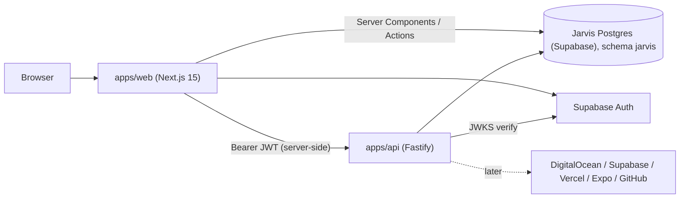

# Jarvis

Internal operations dashboard for Inteck. Each morning it shows each client's
infrastructure health, deployments, today's tasks and GitHub activity, and it
generates branded monthly client reports. Single user, dark HUD UI.

Current status: **steps 1–2** — monorepo scaffold, database schema, auth, theme,
app shell and a seed script with 30 days of mock data for the pilot client (IDS).
No live integrations yet.

## Architecture



| Path              | What                                                                                      |
| ----------------- | ----------------------------------------------------------------------------------------- |
| `apps/web`        | Next.js 15 App Router UI. Auth middleware, app shell, Server Actions for simple CRUD.     |
| `apps/api`        | Fastify API: integrations, scheduled jobs, credentials, PDFs (later). Verifies every JWT. |
| `packages/db`     | Prisma schema, migrations, client singleton, seed script.                                 |
| `packages/shared` | Shared constants, time helpers (Europe/London), zod schemas, metric rollup logic.         |

Internal packages ship TypeScript source; Next.js transpiles them and the API is
bundled with tsup.

## Prerequisites

- Node.js 22 LTS or newer (`.nvmrc` pins 22)
- pnpm 10 — `npm i -g pnpm@10` (Node 25+ no longer ships corepack)
- A **dedicated Supabase project for Jarvis** (separate from any client project)

## Supabase setup (one-off)

1. Create a Supabase project for Jarvis (e.g. region London `eu-west-2`).
2. **Project Settings → API**: copy the project URL, anon key and service role key
   into `.env`.
3. **Connect → ORMs → Prisma**: copy the pooled (6543) URL into `DATABASE_URL` and
   the session/direct (5432) URL into `DIRECT_URL`. Append `schema=jarvis` to both
   (see `.env.example`). Jarvis tables live in the `jarvis` schema, which Supabase's
   public Data API does not expose.
4. **Authentication → Sign In / Providers**:
   - Turn **off** "Allow new users to sign up".
   - Keep the **Email** provider enabled (magic links).
5. **Authentication → URL Configuration**:
   - Site URL: `http://localhost:3000` (your production URL when deployed).
   - Redirect URLs: add `http://localhost:3000/auth/callback` (and the production equivalent).
6. Create the single user: `pnpm auth:create-user` (uses `SUPABASE_SERVICE_ROLE_KEY`
   to create `ALLOWED_EMAIL` with the email pre-confirmed).

The default email template works as-is (PKCE `code` flow). A custom template using
`{{ .TokenHash }}` also works: link to `/auth/callback?token_hash={{ .TokenHash }}&type=magiclink`.

## Running locally

```bash
pnpm install
cp .env.example .env        # fill in the Supabase values and ALLOWED_EMAIL
pnpm db:deploy              # apply migrations to the jarvis schema
pnpm auth:create-user       # once
pnpm db:seed                # IDS pilot + 30 days of mock data (wipes Jarvis data)
pnpm dev                    # web on :3000, api on :4000
```

Open http://localhost:3000, enter `ALLOWED_EMAIL`, click the link in the email.

### Seed scenarios

The seed is deterministic and relative to "now", so re-run it to refresh the data.
It **deletes all Jarvis data first** and refuses to run with `NODE_ENV=production`
unless `--force` is passed.

```bash
pnpm db:seed                          # amber (default)
pnpm db:seed -- --scenario=healthy
pnpm db:seed -- --scenario=red
```

| Scenario  | Production state                                                                     |
| --------- | ------------------------------------------------------------------------------------ |
| `amber`   | workforce-api restarted ~6h ago; html-pdf-api memory ~77% (peak ~78.5%).             |
| `healthy` | No recent restarts, memory normal.                                                   |
| `red`     | As amber, plus a failed latest workforce-api deploy and html-pdf-api currently down. |

In every scenario development has noise that must never turn the client red: a
failed latest html-pdf-api dev deploy, a dev deploy still building, dev restarts
and short dev outages.

What gets seeded for **Industrial Door Systems** (`slug: ids`):

- 4 Inteck-owned provider accounts (DigitalOcean, Supabase, Vercel, Expo) using `ENV_TOKEN`
- 5 repositories in `industrial-door-systems` (`main` → production, `pre-production` → development; mobile has no dev branch)
- 11 resources: 4 DO App Platform apps (workforce-api and html-pdf-api, prod + dev),
  2 Supabase databases, 2 edge-function resources, 2 Vercel environments, 1 Expo app
- ~18k metric snapshots (15-min for 30 days, 5-min for the last 24h) and their hourly rollups
- ~52k health checks (5-min, 1-min for the last 2h) including a 15-min production outage 12 days ago
- ~120 deployments, 8 EAS builds, iOS store versions, daily edge-function stats, 16 tasks (some with descriptions and comment threads)

All external IDs and URLs are fake (`mock-…`).

## Scripts

| Command                 | Description                                           |
| ----------------------- | ----------------------------------------------------- |
| `pnpm dev`              | Run web and api in watch mode                         |
| `pnpm build`            | Production build of all apps                          |
| `pnpm typecheck`        | TypeScript across the workspace                       |
| `pnpm lint`             | ESLint                                                |
| `pnpm test`             | Vitest (API auth, metric rollups)                     |
| `pnpm format`           | Prettier                                              |
| `pnpm db:deploy`        | Apply pending migrations                              |
| `pnpm db:migrate`       | Create a new migration after editing the schema (dev) |
| `pnpm db:seed`          | Reset and seed mock data                              |
| `pnpm db:studio`        | Prisma Studio                                         |
| `pnpm db:reset`         | Drop and re-apply all migrations (no seed)            |
| `pnpm auth:create-user` | Create the `ALLOWED_EMAIL` user in Supabase Auth      |

`db:migrate` uses `prisma migrate dev`, which needs a temporary shadow database.
If your Supabase role can't create one, set `shadowDatabaseUrl` to a second empty
database (e.g. a local Postgres).

## Environment variables

See `.env.example` for the full annotated list.

| Variable                         | Used by      | Needed from                     |
| -------------------------------- | ------------ | ------------------------------- |
| `DATABASE_URL`, `DIRECT_URL`     | db, web, api | now                             |
| `NEXT_PUBLIC_SUPABASE_URL`       | web, api     | now                             |
| `NEXT_PUBLIC_SUPABASE_ANON_KEY`  | web, api     | now                             |
| `SUPABASE_SERVICE_ROLE_KEY`      | api scripts  | now                             |
| `ALLOWED_EMAIL`                  | web, api     | now                             |
| `API_URL`                        | web, api     | now                             |
| `ENCRYPTION_KEY`                 | api          | step 4 (only for stored tokens) |
| `DO_API_TOKEN`                   | api          | step 4 (discovery), step 8      |
| `SUPABASE_ACCESS_TOKEN`          | api          | step 4 (discovery), step 9      |
| `VERCEL_TOKEN`, `VERCEL_TEAM_ID` | api          | step 4 (discovery), step 10     |
| `GITHUB_TOKEN`                   | api          | step 11                         |
| `EXPO_TOKEN`                     | api          | step 4 (discovery), step 12     |
| `AI_ENABLED`, `AI_API_KEY`       | api          | step 15                         |

The API also honours `PORT` (set by hosting platforms), `HOST` and `LOG_LEVEL`.

Token how-tos: [DigitalOcean](docs/setup-digitalocean.md), [Supabase](docs/setup-supabase.md),
[Vercel](docs/setup-vercel.md), [Expo](docs/setup-expo.md).

## Provider accounts and resources

Settings → Provider accounts. Each account is either:

- **Environment variable** (Inteck-owned): the account stores only the variable
  _name_. It must be the provider's default (`DO_API_TOKEN`, `SUPABASE_ACCESS_TOKEN`,
  `VERCEL_TOKEN`, `EXPO_TOKEN`) or that name plus a suffix, e.g. `DO_API_TOKEN_ACME`,
  so an account can never read unrelated secrets. Vercel pairs `VERCEL_TOKEN_X` with
  `VERCEL_TEAM_ID_X`. Restart the API after editing `.env`.
- **Stored, encrypted** (client-owned): the token is sent to the API once and saved
  AES-256-GCM encrypted with `ENCRYPTION_KEY`. It is never shown again; the UI only
  sees the last four characters.

Settings is only for tokens: **Test connection** checks one. Resources are imported
from the client: **Clients → client → Add resources**. Pick a provider account; Jarvis
lists everything it can see (marking what's already imported, including for other
clients) and imports straight into that client. Import each environment as its own
resource (e.g. the prod and dev DO apps separately; a Vercel project twice, production
and preview branches). The environment is suggested from the name/branch and always
confirmed by you. A client's own account can be connected from the same page, and
resources can also be added by hand, edited or deleted there.
Repositories are added per client (paste a GitHub URL); the GitHub picker arrives in
step 11.

## Morning dashboard

One card per active client. The RAG status comes from **production only**
(`packages/shared/src/health.ts`):

- CPU / memory / disk: amber ≥ 75%, red ≥ 90% (disk on App Platform is N/A, never an error)
- Restarts in the last 24h: any = amber, 3+ = red
- Latest deployment failed = red; health check down = red
- Readings older than 20 min (metrics) or 5 min (health checks) are ignored and shown
  grey as a data gap; missing data never hides a real reading

Development resources sit in a collapsed, muted section and never change the client's
colour. The side column lists warnings, overdue and today's tasks, and GitHub activity
(connects in step 11). Mock data only looks "live" right after `pnpm db:seed`.

## Tasks

**Tasks** has a quick-add bar (title, client or Internal, due date) and views for
Overdue / Today / Upcoming / Completed, filterable by client. "Today" is the London
calendar day; due dates are stored as 12:00 UTC on that day. Open a task to edit its
description and discuss it in comments. Each client page shows its next open tasks with
its own quick-add.

Coming next (5b): a private link per client contact (`/p/…`, no sign-up) so clients can
comment and raise requests; internal tasks are never shown there.

## Auth model

- Supabase Auth magic link, `shouldCreateUser: false`, sign-ups disabled.
- `ALLOWED_EMAIL` is enforced in the login action (no email is sent to anyone else;
  the response is identical either way), the auth callback (other users are signed
  out), the Next.js middleware (every route except `/login`, `/auth/*` and the
  public report links `/r/*`) and the authenticated layout.
- `apps/api` verifies the Supabase JWT on every request except `GET /health`
  (signature via the project's JWKS, issuer, `aud=authenticated`, email). Legacy
  HS256 projects fall back to asking Supabase Auth, cached for 60s.
- The browser never calls the API directly; the web server forwards the user's token.

## Security notes

- Jarvis tables are in the `jarvis` Postgres schema, not `public`.
- Stored provider credentials are AES-256-GCM encrypted with `ENCRYPTION_KEY` and
  decrypted only in `apps/api`. `apps/web` never selects the ciphertext; the API
  returns masked values only. Secrets are never logged (the API redacts
  `Authorization` and `Cookie` headers, and provider errors are reduced to a status
  and the provider's message). Changing `ENCRYPTION_KEY` makes stored tokens
  unreadable; re-enter them if you rotate it.

## Deploying

- **Web**: Vercel, root directory `apps/web`. Set the env vars above. Vercel builds
  with `pnpm build` via Turborepo.
- **API**: DigitalOcean App Platform service (or any Node 22 host):
  build `pnpm install && pnpm --filter @jarvis/api... build`, run
  `node apps/api/dist/index.js`. PDF generation (step 14) will need Chromium.
- **Migrations**: run `pnpm db:deploy` against production before deploying.
- Add the production `/auth/callback` URL to Supabase redirect URLs.
